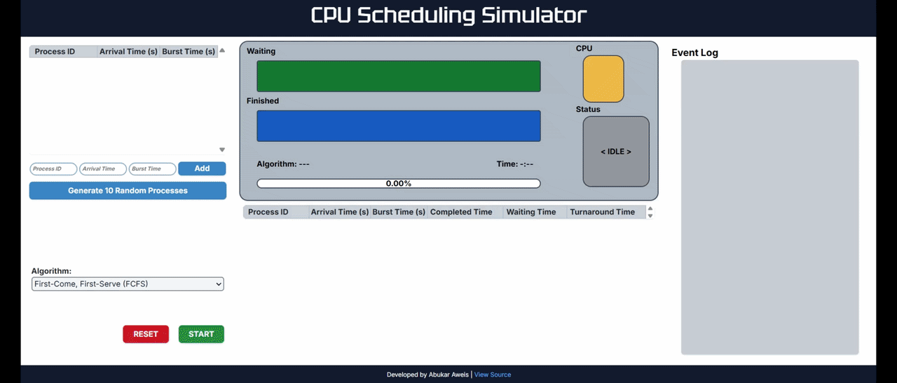

# CPU Scheduling Simulator

An interactive CPU scheduling simulator built with JavaScript, HTML, and CSS. The application visualizes how processes move through the waiting queue, CPU, and finished queue while simulating First Come First Serve (FCFS), Shortest Job First (SJF), and Round Robin (RR) scheduling algorithms.

The simulator supports custom process creation, randomly generated processes, real-time execution controls, input validation, and performance metrics including waiting time, turnaround time, throughput, and CPU utilization.

> This is an independently developed personal project. All application code, scheduling logic, interface behavior, and visual design were implemented by me.

## Demo

Try the simulator directly in your browser:

[Live Demo](https://abukaraweis.github.io/scheduling-simulator/)

The animation below shows a complete scheduling simulation, including process arrivals, queue movement, CPU execution, progress tracking, and final performance metrics.

  

## Features

- Simulates **First Come First Serve (FCFS)**, **Shortest Job First (SJF)**, and **Round Robin (RR)** scheduling
- Supports manual process entry with process ID, arrival time, and burst time
- Can automatically generate a set of random processes
- Visualizes processes moving through the waiting queue, CPU, and finished queue in real time
- Includes start, pause, resume, and reset controls
- Validates process input and Round Robin time quantum values
- Displays a live event log during simulation
- Calculates and displays:
  - completion time
  - waiting time
  - turnaround time
  - throughput
  - CPU utilization
- Displays simulation progress and a completed-process summary table

## Scheduling Algorithms

### First Come First Serve (FCFS)

A non-preemptive scheduling algorithm that executes processes in arrival order. If multiple processes arrive at the same time, the process with the lower ID is prioritized.

### Shortest Job First (SJF)

A non-preemptive scheduling algorithm that selects the available process with the shortest burst time whenever the CPU becomes available.

### Round Robin (RR)

A preemptive scheduling algorithm that gives each process a fixed amount of CPU time based on the selected time quantum. If a process does not finish within its quantum and another process is waiting, it is returned to the waiting queue.

## How It Works

1. The user adds processes manually or generates a random set of processes.
2. Each process is assigned a process ID, arrival time, and burst time.
3. The selected scheduling algorithm determines when each process enters the waiting queue and when it is sent to the CPU.
4. The simulator updates once per second, decrementing the active process burst time and moving completed processes to the finished queue.
5. The interface updates the waiting queue, CPU state, finished queue, progress bar, event log, and summary table in real time.
6. After all processes complete, the simulator calculates overall performance metrics including average waiting time, average turnaround time, throughput, and CPU utilization.

## Implementation

The simulator is organized into separate JavaScript modules based on responsibility:

### `state.js`

Stores shared simulation state, including:

- waiting, finished, and CPU queues
- timer state
- selected scheduling algorithm
- process counters
- performance metric totals

### `ui.js`

Handles user-interface updates, including:

- DOM element references
- progress display
- event log updates
- summary table updates
- error messages
- time formatting

### `processes.js`

Handles process-related behavior, including:

- manual process creation
- random process generation
- input validation
- queue movement
- CPU assignment
- process visualization

### `algorithms.js`

Contains the implementations of:

- First Come First Serve (FCFS)
- Shortest Job First (SJF)
- Round Robin (RR)

### `main.js`

Controls the overall simulation lifecycle, including:

- starting simulations
- pausing and resuming
- resetting
- timer updates
- selecting and running the active scheduling algorithm

## Technologies

- JavaScript
- HTML
- CSS
- Bootstrap
- Git
- GitHub Pages

## Limitations

The simulator is designed primarily for desktop use and has not been optimized for mobile devices.

The scheduling algorithms are simplified educational implementations and do not model every aspect of a real operating system scheduler, such as context-switch overhead, priorities, I/O blocking, or multi-core execution.

Process IDs are intended to be small numeric values, and the interface is optimized for typical demo-sized workloads rather than extremely large process sets.